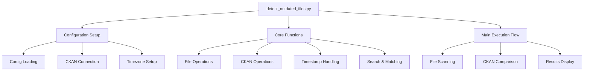
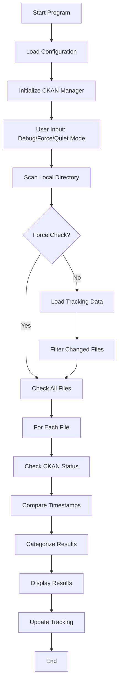
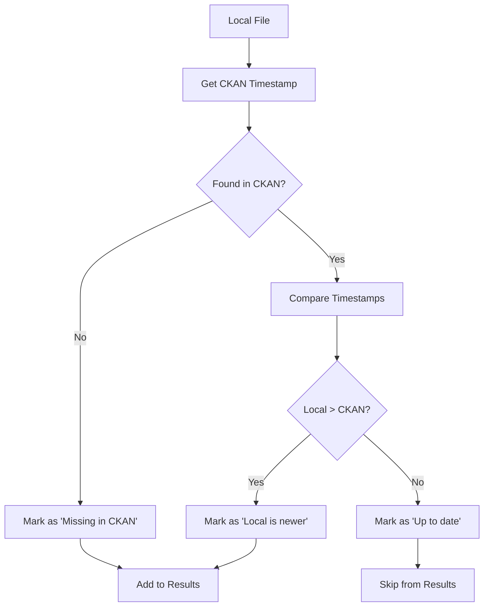

# CKAN File Monitoring Tool - Complete Documentation

## 📋 Overview

The CKAN File Monitoring Tool (`detect_outdated_files.py`) is a sophisticated Python application designed to monitor local files and synchronize them with CKAN datasets. It provides intelligent file discovery, precise timestamp comparison, and comprehensive reporting capabilities.

### 🎯 Key Features

- **Smart File Discovery**: Intelligent CKAN dataset matching using multiple strategies
- **Resource-Level Timestamps**: Precise comparison using CKAN resource timestamps instead of dataset timestamps
- **Timezone Handling**: Automatic UTC to Berlin timezone conversion
- **Tracking System**: File change tracking to optimize performance
- **Comprehensive Reporting**: Detailed results with categorization and statistics
- **Debug Mode**: Extensive debugging capabilities for troubleshooting

## 🏗️ Architecture Overview



## 📦 Dependencies & Configuration

### Required Libraries
```python
import os, configparser, json
from datetime import datetime, timezone
from collections import defaultdict
import re
import pytz
from ckan_manager import CKANManager
```

### Configuration Components
- **Config File**: `config.ini` for API keys and URLs
- **Monitor Directory**: `MONITOR_DIR` - Directory to scan for files
- **File Filters**: Allowed/excluded extensions and directories
- **Tracking File**: `file_tracking.json` - Maintains file state
- **Timezone**: Berlin timezone for local time conversion

## 🔄 Core Function Categories

### 1. File System Operations

| Function | Purpose |
|----------|---------|
| `scan_directory()` | Scan local files with filtering |
| `get_file_info()` | Extract file metadata (size, timestamps) |
| `load_file_tracking()` | Load tracking state from JSON |
| `save_file_tracking()` | Save tracking state to JSON |
| `format_file_size()` | Convert bytes to human-readable format |

### 2. Timestamp & Timezone Handling

| Function | Purpose |
|----------|---------|
| `parse_ckan_timestamp()` | Parse CKAN UTC timestamps |
| `convert_utc_to_berlin()` | Convert UTC to Berlin timezone |

**Timezone Flow:**
```
CKAN UTC Time → parse_ckan_timestamp() → convert_utc_to_berlin() → Berlin Local Time → Comparison
```

### 3. CKAN Dataset Discovery

The tool uses a sophisticated two-strategy approach for finding CKAN datasets:

#### Strategy 1: Direct Dataset ID Lookup
```python
def generate_possible_dataset_ids(file_path):
    # Priority order:
    # 🥇 CKAN standardized (alphanumeric only)
    # 🥈 Full filename standardized  
    # 🥉 Original filename variants
    # 🔧 Simple lowercase variant
    # 🔄 Hyphenated version
```

#### Strategy 2: Search API Queries
```python
def generate_search_terms_from_file(file_path):
    # Generates multiple search variants:
    # - Original filename (with/without extension)
    # - Lowercase versions
    # - CKAN standardized version
    # - Spaced/hyphenated variants
    # - Individual words
```

### 4. Resource Matching Algorithm

```python
def find_matching_resource(resources, filename, debug=False):
    # Scoring system (higher = better match):
    # 100 points: Exact filename match
    # 90 points:  Filename without extension match
    # 80 points:  URL contains filename
    # 70 points:  URL contains filename base
    # 60 points:  Format + partial name match
    # 50 points:  Only resource available
```

## 🎯 Main Execution Flow

### Program Entry Point: `main_resource_timestamp_version()`



### File Processing Logic



## 📊 Data Structures

### File Information Object
```json
{
  "path": "full/file/path",
  "size": 1024,
  "created": "datetime_object",
  "reason": "Local is newer | Missing in CKAN",
  "time_diff": 3600
}
```

### CKAN Resource Matching Result
```json
{
  "match_score": 100,
  "resource": "ckan_resource_object", 
  "timestamp": "datetime_object",
  "match_reasons": ["Exact filename match"]
}
```

### Tracking Data Structure
```json
{
  "file_path_1": "last_seen_timestamp",
  "file_path_2": "last_seen_timestamp"
}
```

## 🔍 Search Strategy Details

### Dataset ID Generation Priority
1. **🥇 Highest Priority**: CKAN standardized (alphanumeric only)
   - `"My_File-Name.pdf"` → `"myfilename"`
2. **🥈 High Priority**: Full filename standardized
   - `"My_File-Name.pdf"` → `"myfilenamepdf"`
3. **🥉 Medium Priority**: Original filename variants
4. **🔧 Low Priority**: Simple lowercase, hyphenated versions

### Search Term Generation
```python
# Example for "Ying_CV.pdf":
search_terms = [
    "Ying_CV.pdf",      # Original with extension
    "Ying_CV",          # Without extension  
    "ying_cv.pdf",      # Lowercase with extension
    "ying_cv",          # Lowercase without extension
    "yingcv",           # CKAN standardized
    "Ying CV",          # Spaced version
    "Ying", "CV"        # Individual words
]
```

## 🎨 Output & Reporting Features

### Result Categories
- **📊 Statistics**: By file type and sync reason
- **📁 Grouping**: By file extensions and categories
- **📈 Summaries**: Size totals and file counts
- **💡 Icons**: Visual indicators for different states

### Status Icons
- **🆕** = Missing in CKAN (needs new dataset)
- **📝** = Local file newer (needs update)
- **✅** = Up to date
- **🎯** = Resource timestamp comparison active

### Timezone Display
- **🌍** Automatic UTC → Berlin conversion
- **🕐** Detailed timestamp comparisons
- **⏰** Current Berlin time display
- **📅** Human-readable date formats

## 🔧 Debug & Utility Functions

### Debug Functions
| Function | Purpose |
|----------|---------|
| `debug_search_results()` | Test search functionality with detailed output |
| `debug_tracking_file()` | Inspect tracking data content |
| `display_results()` | Format and display results with statistics |

### Quiet Mode Feature
The tool supports a "quiet mode" that suppresses verbose debug output while maintaining essential functionality:

```python
# Quiet mode affects:
# - CKAN API call details
# - Search result debugging  
# - Timestamp transformation details
# - Resource matching details
```

## ⚙️ Configuration Options

### User Input Options
1. **Debug Mode**: Enable detailed logging and output
2. **Force Check**: Check all files regardless of tracking status
3. **Quiet Mode**: Suppress verbose debug output

### File Filtering
- **Allowed Extensions**: Configurable file type filtering
- **Excluded Directories**: Skip specific directories
- **Excluded Extensions**: Skip temporary/system files

### Supported File Categories
- **Documents**: PDF, DOC, DOCX, TXT, RTF, ODT
- **Spreadsheets**: XLSX, XLS, CSV, ODS
- **Data**: JSON, XML, YAML, SQL
- **Images**: JPG, PNG, GIF, BMP, SVG, TIFF, WebP
- **Archives**: ZIP, RAR, 7Z, TAR, GZ, BZ2
- **Scripts**: PY, JS, SH, BAT, PS1, R
- **Config**: INI, CONF, CFG, Properties, ENV
- **Media**: MP4, AVI, MOV, MP3, WAV, FLAC
- **🆕 3D Models**: OBJ, FBX, DAE, 3DS, Blender, Maya, Cinema4D, IFC, STEP, glTF, USD, STL, PLY
- **🆕 2D Geo Files**: Shapefile, KML, GPX, GeoJSON, DWG, DXF, GeoTIFF, NetCDF, HDF5, LAS/LAZ

## 🚀 Usage Examples

### Basic Usage
```bash
python detect_outdated_files.py
# Prompts for: Debug mode? Force check? Quiet mode?
```

### Typical Workflow
1. **Scan**: Tool scans the monitor directory
2. **Filter**: Applies file filters and tracking logic
3. **Lookup**: Searches CKAN for matching datasets
4. **Compare**: Compares timestamps (Resource-level)
5. **Report**: Displays categorized results
6. **Track**: Updates tracking file for next run

## 🎯 Key Improvements & Features

### Resource-Level Timestamp Comparison
- **Previous**: Used dataset-level timestamps (less accurate)
- **Current**: Uses resource-level timestamps (precise)
- **Benefit**: More accurate synchronization detection

### Intelligent Search Strategies
- **Fallback System**: Multiple strategies ensure high success rate
- **Scoring Algorithm**: Prioritizes best matches
- **Flexible Matching**: Handles various naming conventions

### Performance Optimization
- **File Tracking**: Only checks changed files (unless forced)
- **Efficient Filtering**: Skips irrelevant files early
- **Parallel Processing**: Ready for concurrent operations

## 📈 Benefits & Use Cases

### Primary Benefits
- **Improved Maintainability**: Object-oriented design with clear separation
- **Enhanced Accuracy**: Resource-level timestamp comparison
- **Better Performance**: Intelligent tracking and filtering
- **Professional Output**: Comprehensive reporting with statistics
- **Debugging Support**: Extensive debug capabilities

### Use Cases
- **Data Synchronization**: Keep CKAN datasets up-to-date with local files
- **Content Management**: Monitor file changes in data repositories
- **Backup Verification**: Ensure CKAN has latest file versions
- **Audit Trails**: Track file modification patterns

## 🔮 Future Enhancements

### Potential Improvements
- **Batch Operations**: Automated upload/update capabilities
- **Configuration GUI**: User-friendly configuration interface
- **Email Notifications**: Alert on outdated files
- **API Integration**: Direct CKAN update functionality
- **Multi-Directory Support**: Monitor multiple directories simultaneously

---

*This documentation covers the complete architecture and functionality of the CKAN File Monitoring Tool. For technical support or feature requests, refer to the source code comments and debug output.*