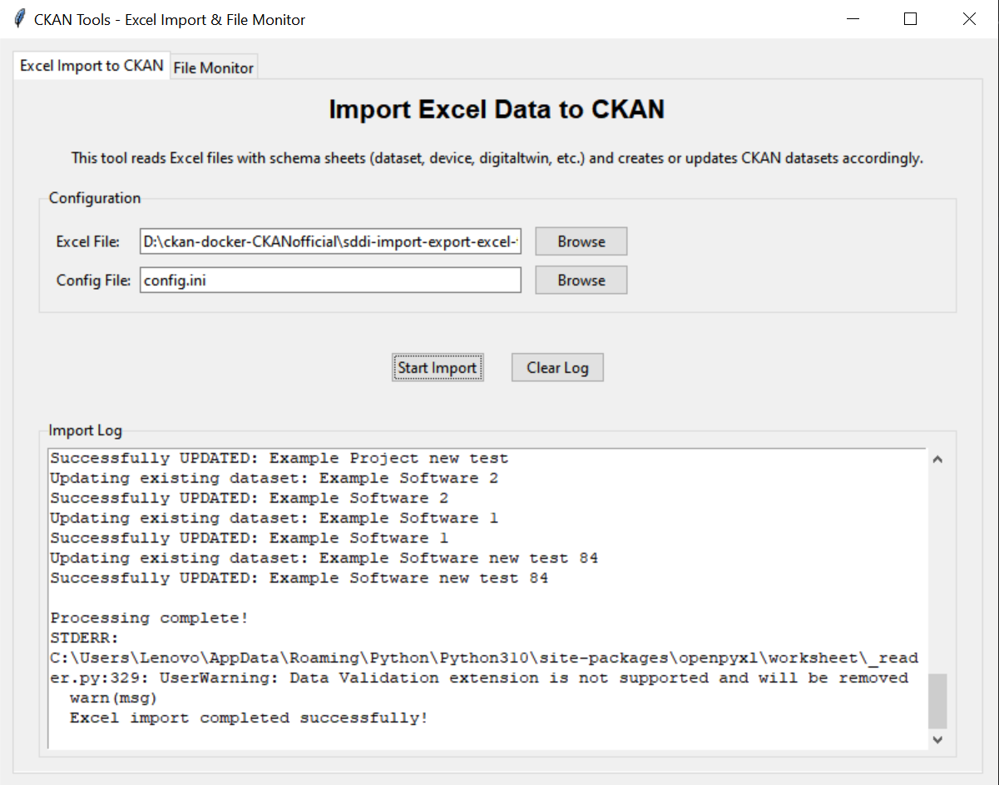
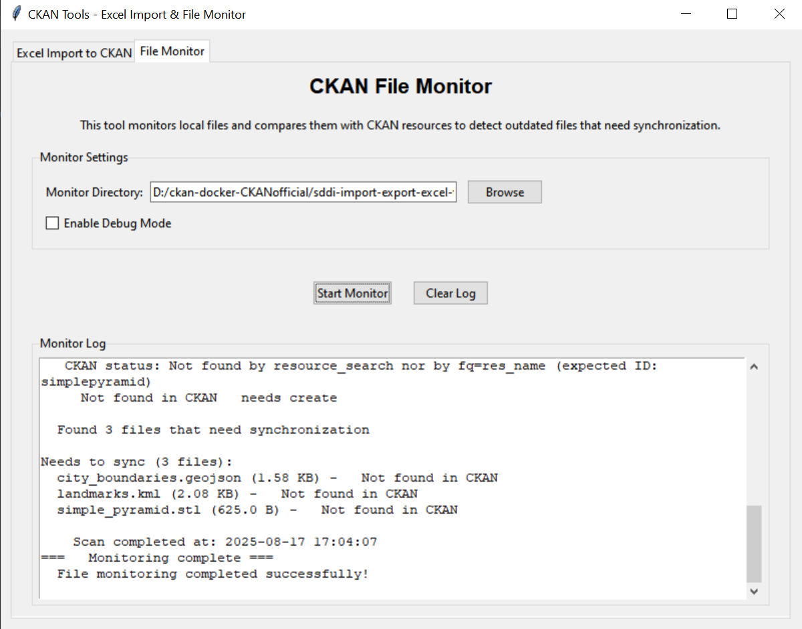

          
# CKAN Tools - Excel Import & File Monitor

A comprehensive toolkit for managing CKAN datasets through Excel imports and file monitoring capabilities.

## Overview

This toolkit provides three main components:
1. **Excel Import Tool** (`create_cat.py`) - Import metadata from Excel files to create/update CKAN datasets
2. **File Monitor Tool** (`detect_outdated_files.py`) - Monitor local files and compare with CKAN resources
3. **GUI Application** (`ckan_tools_ui.py`) - User-friendly interface for both tools

## Features

### Excel Import Tool
- Reads Excel files with multiple schema sheets (dataset, device, digitaltwin, etc.)
- Creates or updates CKAN datasets based on Excel metadata
- Supports multiple schema types: dataset, device, digitaltwin, geoobject, onlineapplication, onlineservice, project, software
- Handles complex field mappings and data validation
- Manages organizations, groups, tags, and resources automatically
- Supports both public and private datasets

### File Monitor Tool
- Resource-first file monitoring approach
- Compares local file timestamps with CKAN resource timestamps
- Automatic timezone conversion (UTC to Europe/Berlin)
- Supports multiple file formats and categories
- Provides detailed sync status reports
- Categorizes files by type (Documents, Images, 3D Models, Geo Files, etc.)

### GUI Application
- Tabbed interface for both Excel import and file monitoring
- Real-time log output with Unicode support
- File browser integration
- Configuration management
- Progress tracking and error handling

## Installation

### Prerequisites
- Python 3.7+
- CKAN instance with API access

### Required Dependencies
```bash
pip install -r requirements.txt
```

Key dependencies:
- `openpyxl` - Excel file handling
- `requests` - HTTP API communication
- `pytz` - Timezone handling
- `tkinter` - GUI framework (usually included with Python)

## Configuration

### 1. Create Configuration File
Copy `config.ini.example` to `config.ini` and configure:

```ini
[DEFAULT]
api_key = your-ckan-api-key
instance_url = https://your-ckan-instance.com
excel_file_path = SDDI-Metadata.xlsx
schema_config = schema_templates/schema_config.json

[Monitoring]
monitor_dir = /path/to/monitor/directory
allowed_extensions = *
excluded_extensions = .tmp,.log,.cache,.pyc,.pyo,.bak,.swp,.DS_Store
exclude_dirs = __pycache__,schema_templates,templates
```

### 2. Schema Templates
The tool uses JSON schema templates located in `schema_templates/`:
- `dataset_template.json`
- `device_template.json`
- `digitaltwin_template.json`
- `geoobject_template.json`
- `onlineapplication_template.json`
- `onlineservice_template.json`
- `project_template.json`
- `software_template.json`

## Usage

### GUI Application (Recommended)
```bash
python ckan_tools_ui.py
```

The GUI provides:
- **Excel Import Tab**: Configure and run Excel imports

- **File Monitor Tab**: Monitor file synchronization status


### Live Web Application
For convenient access without local installation, you can use the live web application:

🌐 **Live Demo**: https://w6azqhwjha2u9sphspmivn.streamlit.app/

The web application provides the same functionality as the local GUI:
- Excel import capabilities
- File monitoring tools
- Real-time processing and feedback
- No installation required - runs directly in your browser

*Note: The live web app is hosted on Streamlit Cloud and provides the same core features as the local application.*

### Command Line Usage

#### Excel Import
```bash
python create_cat.py
```

#### File Monitor
```bash
# Basic monitoring
python detect_outdated_files.py

# With debug output
python detect_outdated_files.py --debug
```

## Excel File Format

**Important**: If users want to use the import metadata from Excel files to create/update CKAN datasets tool, users have to fill in this table by categories in `SDDI-Metadata.xlsx`. Then the tool will based on the content in the excel to registrate data on CKAN.

The Excel file should contain separate sheets for each schema type:

### Required Sheets
- `dataset` - General datasets
- `device` - Hardware devices
- `digitaltwin` - Digital twin models
- `geoobject` - Geographic objects
- `onlineapplication` - Web applications
- `onlineservice` - Online services
- `project` - Project information
- `software` - Software packages

### Column Mapping
Each sheet should have columns that map to CKAN fields as defined in the schema templates. Common columns include:
- `Name` - Dataset title
- `Beschreibung` - Description
- `Organisation` - Owner organization
- `Datei/ Link` - Resource URL
- `Format` - File format
- `zugriffsrechte` - Access rights
- `Sichtbarkeit` - Visibility (public/private)

## File Monitoring

The file monitor tool:
1. Scans the configured directory for supported files
2. Queries CKAN for matching resources by name
3. Compares timestamps (local creation time vs CKAN last_modified)
4. Reports files that need synchronization

### Supported File Categories
- **Documents**: PDF, DOC, DOCX, TXT, etc.
- **Spreadsheets**: XLSX, XLS, CSV, ODS
- **Images**: JPG, PNG, GIF, SVG, etc.
- **3D Models**: STL, OBJ, FBX, GLTF, IFC, etc.
- **Geo Files**: SHP, KML, GeoJSON, GPX, etc.
- **Archives**: ZIP, RAR, 7Z, TAR, etc.

## API Integration

The tools integrate with CKAN API endpoints:
- `package_create` - Create new datasets
- `package_update` - Update existing datasets
- `package_show` - Retrieve dataset information
- `resource_search` - Search for resources
- `package_search` - Search for packages

## Error Handling

- **Unicode Support**: Handles special characters and emojis
- **SSL Verification**: Supports self-signed certificates
- **Timeout Management**: 300-second timeout for operations
- **Graceful Degradation**: Fallback mechanisms for API failures

## Troubleshooting

### Common Issues

1. **Unicode Errors**: The GUI handles Unicode characters by converting them to ASCII equivalents
2. **SSL Warnings**: Disabled for self-signed certificates
3. **Timeout Issues**: Large files may require timeout adjustments
4. **Schema Validation**: Ensure Excel columns match schema template mappings

### Debug Mode
Enable debug mode for detailed logging:
```bash
python detect_outdated_files.py --debug
```

## File Structure
```
sddi-import-export-excel-tool/
├── ckan_tools_ui.py          # GUI application
├── create_cat.py             # Excel import tool
├── detect_outdated_files.py  # File monitor tool
├── ckan_manager.py           # CKAN API wrapper
├── config.ini.example        # Configuration template
├── SDDI-Metadata.xlsx        # Default Excel template
├── schema_templates/         # JSON schema definitions
├── TEST/                     # Test files directory
└── requirements.txt          # Python dependencies
```

## Contributing

1. Ensure all dependencies are installed
2. Follow the existing code structure
3. Test with both GUI and command-line interfaces
4. Update schema templates as needed

## License

This project is part of the CKAN ecosystem and follows standard open-source practices.
        